# System Architecture

This document describes the high-level architecture of the **Student Project Showcase Platform**.

## Overview

The application is built using a **Modular Monolith** pattern on the backend and a **Component-Based Architecture** on the frontend. It uses the **MERN** stack (MongoDB, Express, React, Node.js) with **TypeScript** as the primary language across the entire stack.

```mermaid
graph TD
    Client[React Frontend] <--> API[Express API]
    API <--> Auth[JWT / Google OAuth]
    API <--> DB[(MongoDB)]
    API --> SMTP[Email Service]
    
    subgraph Frontend
        Client
        Context[Auth/Theme Context]
        Pages[Pages/Components]
    end
    
    subgraph Backend
        API
        Routes[Routes]
        Controllers[Controllers]
        Middlware[Middleware]
        Models[Mongoose Models]
    end
```

## Tech Stack Justification

### Frontend
- **React & Vite**: Chosen for fast development speed, excellent ecosystem, and performance.
- **Tailwind CSS**: Allows for rapid UI prototyping with a utility-first approach.
- **TypeScript**: Provides static typing to catch errors early and improve maintainability.

### Backend
- **Express.js**: A lightweight and flexible framework that is standard for Node.js APIs.
- **MongoDB & Mongoose**: NoSQL provides the flexibility needed for project data which can vary in complexity. Mongoose adds structure and validation.
- **JWT**: Standard for stateless authentication in modern web apps.

## Core Workflows

### 1. User Authentication
A dual-layer authentication system:
- **Email/Password**: Traditional login with email verification and password reset capabilities.
- **Google OAuth**: One-tap sign-in for ease of use.

### 2. Project Approval Flow
1. **Student** uploads a project and assigns an **Instructor**.
2. **Admin** reviews the project for content moderation (Pending -> Approved/Rejected).
3. **Instructor** (once project is approved by admin) adds technical feedback.
4. **General Public** can view the project and the instructor's feedback.

### 3. Notification System
An event-driven notification system triggers alerts for:
- New project assignments (to instructors).
- Feedback updates (to students).
- Account approvals (to instructors from admins).
