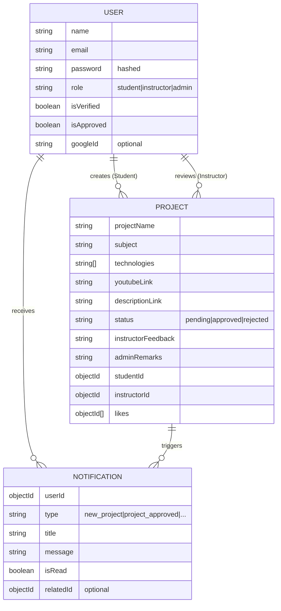

# Database Documentation

The platform uses **MongoDB** as its primary data store, with **Mongoose** for object data modeling (ODM).

## Entity Relationship Diagram (ERD)

## Models Breakdown

### User Model (`server/src/models/User.ts`)
- **Roles**: Supports `student`, `instructor`, and `admin`.
- **Verification**: Email verification token logic is built directly into the model.
- **Approval**: Instructors require `isApproved: true` before they can log in (set by Admins).

### Project Model (`server/src/models/Project.ts`)
- **Technologies**: An array of strings representing the tools used in the project.
- **Status**: 
  - `pending`: Default state after upload.
  - `approved`: Visible to the public.
  - `rejected`: Hidden, needs revision based on `adminRemarks`.
- **References**: Linked to both the `studentId` (author) and `instructorId` (reviewer).

### Notification Model (`server/src/models/Notification.ts`)
- **Indexing**: Optimized for retrieving unread notifications by `userId` and `createdAt`.
- **Types**: Tracks events like project approvals, new assignments, and instructor onboarding.

## Performance Considerations
- **Indexes**: 
  - `User`: Email (unique)
  - `Project`: `studentId`, `instructorId`
  - `Notification`: `userId`, `isRead`, `createdAt`
- **Sparse Indexes**: Used for `googleId` to allow multiple users without Google accounts.
